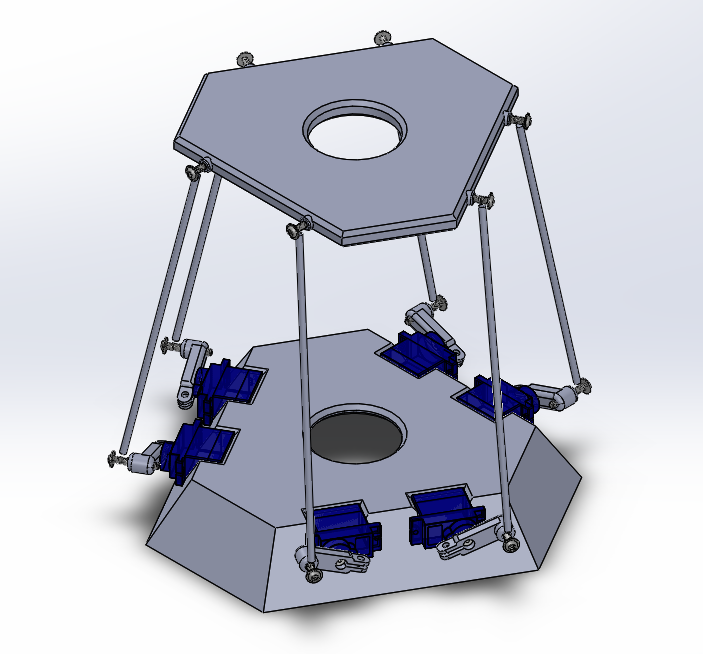

    <h1>SPUdeS</h1>
    <h3>Stewart Platform Université de Sherbrooke</h3>
    <h3>UdeS-GRO | 65th Promotion | 2021</h3>

[//]: # (------------------------------------------------)

    

 

[//]: # (------------------------------------------------)

**SPUdeS is a six degrees of freedom Stewart Platform. This is an academic project by robotics engineering undergraduates at l'Université de Sherbrooke.**

    

## Table of Contents
- [Setup](#Setup)
- [Documentation](#Documentation)
- [Platform Operation](#Operation)
- [External Resources](#Resources)
    - [Single-Board Computer](#Computer)
    - [Microcontroller](#Controller)
    - [Servomotors](#Servo)
    - [Power Supply: Motor/Arduino](#Power)
    - [Servo Rods](#Rods)

    
[//]: # (------------------------------------------------)

## Setup
1. Buy the component in the [External Resources](#Resources) section.
2. Use the [CAD models](https://github.com/SPUdeS/SPUdeS/tree/develop/CADs) to 3D print the [base](https://github.com/SPUdeS/SPUdeS/blob/develop/CADs/Base.SLDPRT), the [platform](https://github.com/SPUdeS/SPUdeS/blob/develop/CADs/Platform.SLDPRT) and the [servo arms](https://github.com/SPUdeS/SPUdeS/blob/develop/CADs/Legs.SLDASM).
3. Do the electrical connections using the [electrical schematics](https://github.com/SPUdeS/SPUdeS/blob/develop/Documentation/Electical%20schematics.pdf) in the documentation section.
3. Set up the [Raspberry Pi](#Computer) by connecting it with the [Arduino](#Controller), your computer and the to a power source.
4. Download or clone the repository in the Raspberry Pi.
5. Verify your Python version (3.5 and above) and the port series.
6. Build and transfer all the code to the Arduino and Raspberry Pi.
7. Open the interface and look at the [platform operation](#Operation) section.
## Documentation

The dynamic system can be found in the [Geometric model](https://github.com/SPUdeS/SPUdeS/tree/develop/Geometric%20model) folder.
## Platform Operation

The camera feed can show the Stewart platform instantly. The platform can be controlled using the following buttons on the interface:

    

-It is possible to enter the angle value of all the motor (by default, all the motor should have the same angle).

-The Homing Button brings the stewart platform at its initial centered position.  

-The Move Up Button brings the stewart platform a bit over its actual position
## External Resources
This section specifies the external resources used in the project.

#### Single-Board Computer
- Brand: [Raspberry Pi](https://www.raspberrypi.org/products/raspberry-pi-3-model-b-plus/)
- Model: Raspberry Pi 3 Model 3B+
- Quantity: 1

#### Microcontroller
- Brand: [Arduino](https://store.arduino.cc/mega-2560-r3)
- Model: Mega 2560 REV3
- Quantity: 1

<!--#### Servomotors
- Brand: [Hitec RCD](https://hitecrcd.com/products/servos/sport-servos/analog-sport-servos/hs-422/product)
- Model: HS-422
- Quantity: 6
-->
#### Servomotors
- Brand: [Adafruit](https://www.amazon.ca/Adafruit-2201-Sub-micro-Servo-SG51R/dp/B0137LG0KW)
- Model: SG51R
- Quantity: 6

#### Power Supply: Motor/Arduino
- Brand: [CUI Inc.](https://www.digikey.com/en/products/detail/cui-inc/SWI10-5-N-P5/6618696)
- Model: SWI10-5-N
- Quantity: 1

####  Servo Rods
- Brand: [Amaus](https://www.amazon.ca/-/fr/tirage-r%C3%A9glables-voiture-Tourning-accessoires/dp/B082WCQ4ZR/ref=pd_sbs_5?language=en_CA&pd_rd_i=B082WDXRKH&pd_rd_r=41f4cc38-4f04-4061-ae31-0daa716f90dd&pd_rd_w=uNdGH&pd_rd_wg=BPvl7&pf_rd_p=ba284f11-925a-4926-8142-0043fa482b41&pf_rd_r=2Z5RF9PZ91H1NW58AZP6&th=1)
- ASIN: B082WCQ4ZR
- Quantity: 6

## License
This project is licenced under a   license.
