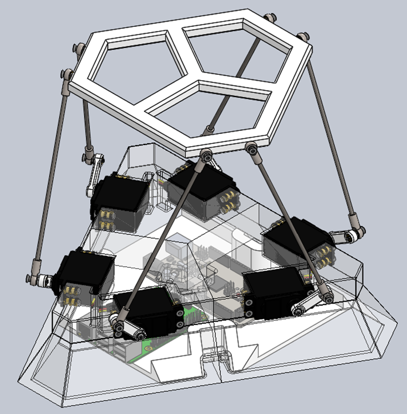
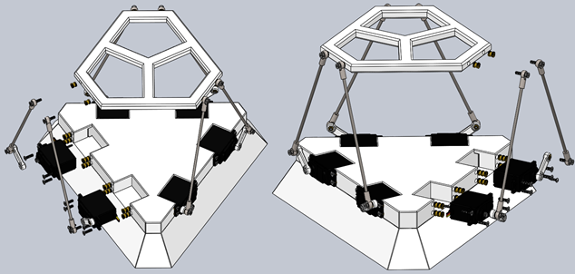
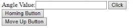

    <h1>SPUdeS</h1>
    <h3>Stewart Platform Université de Sherbrooke</h3>
    <h3>UdeS-GRO | 65th Promotion | 2021</h3>

[//]: # (------------------------------------------------)

    

 

[//]: # (------------------------------------------------)

**SPUdeS is a six degrees of freedom Stewart Platform. This is an academic project by robotics engineering undergraduates at l'Université de Sherbrooke.**

    

## Table of Contents
- [Setup](#Setup)
- [Stewart Platforms](#Stewart)
- [Supplies](#Supplies)
    - [Single-Board Computer](#Computer)
    - [Microcontroller](#Controller)
    - [Servomotors](#Servo)
    - [Power Supply: Motor/Arduino](#Power)
    - [Servo Rods](#Rods)
    - [Hardware](#Hardware)
    - [Parts to solder](#Parts_solder)
    - [Parts to print](#Parts_print)
- [Platform Assembly Guide](#Assembly)
    - [Design](#Design)
    - [CAD Files](#CAD)
    - [Platform](#Platform)
    - [Base](#Base)
    - [Servo motor amrs](#Servo)
    - [Legs](#Legs)
    - [Microcontroller holder](#Holder)
    - [Summary](#Summary)
- [Documentation](#Documentation)  
- [Platform Operation](#Operation)

    
[//]: # (------------------------------------------------)

## Setup
1. Buy the component in the [External Resources](#Resources) section.
2. Use the [CAD models](CADs) to 3D print the [base](CADs/Base.SLDPRT), the [platform](CADs/Platform.SLDPRT) and the [servo arms](CADs/Legs.SLDASM).
3. Do the electrical connections using the [electrical schematics](Documentation/Electical%20schematics.pdf) in the documentation section.
3. Set up the [Raspberry Pi](#Computer) by connecting it with the [Arduino](#Controller), your computer and the to a power source.
4. Download or clone the repository in the Raspberry Pi.
5. Verify your Python version (3.5 and above) and the port series.
6. Build and transfer all the code to the Arduino and Raspberry Pi.
7. Open the interface and look at the [platform operation](#Operation) section.
## Stewart Platforms

A Stewart platform is a type of parallel robot built in such a way as to offer six degrees of freedom. This type of platform was created and publicised in the second half of the 20th century by three different engineers. Distributing the load on six legs allows for a strong manipulator while preserving high precision in movements. The combination of high strength and precision in six degrees of freedom make this type of robot the ideal platform for various simulators (automobile, aviation). This type of robot as also been used for a telescope and tire testing machines.

Fundamentally, the platform is built from six linear actuators in parallel. Each ends of the linear actuators are linked to the fixed base and the manipulator via Heim joints. It is also possible to assemble the platform with rotary actuators. The rotation of an arm connecting to the base of the leg allows for some variation of the effective length of the legs emulating a linear actuator. It is the way we have decided to build our prototype platform since servo motors are cheaper and easier to get our hands on then linear actuators.

## Supplies
#### Single-Board Computer
- Brand: [Raspberry Pi](https://www.raspberrypi.org/products/raspberry-pi-3-model-b-plus/)
- Model: Raspberry Pi 3 Model 3B+
- Quantity: 1

#### Microcontroller
- Brand: [Arduino](https://store.arduino.cc/mega-2560-r3)
- Model: Mega 2560 REV3
- Quantity: 1

#### Servomotors
- Brand: [Hitec RCD](https://hitecrcd.com/products/servos/sport-servos/analog-sport-servos/hs-422/product)
- Model: HS-422
- Quantity: 6

#### Power Adaptor (5V, 6A)
- Brand: [CUI Inc.](https://www.digikey.com/en/products/detail/cui-inc/SWI10-5-N-P5/6618696)
- Model: SWI10-5-N
- Quantity: 1

####  Servo Rods
- Brand: [Amaus](https://www.amazon.ca/-/fr/tirage-r%C3%A9glables-voiture-Tourning-accessoires/dp/B082WCQ4ZR/ref=pd_sbs_5?language=en_CA&pd_rd_i=B082WDXRKH&pd_rd_r=41f4cc38-4f04-4061-ae31-0daa716f90dd&pd_rd_w=uNdGH&pd_rd_wg=BPvl7&pf_rd_p=ba284f11-925a-4926-8142-0043fa482b41&pf_rd_r=2Z5RF9PZ91H1NW58AZP6&th=1)
- ASIN: B082WCQ4ZR
- Quantity: 6

####  Hardware
-	Female Heim joints M3 (12x)
-	Threaded inserts M3 x 6mm (42x; optional)
-	Countersunk bolts M3x6 (6x; optional)
-	Countersunk bolts M3x12 (42x)
-	Nylock nuts M3 (6x)
-	Round head self-tapping screws No3 (6x)

####  Parts to solder
-	PCB to power the 6 motors (proto-board, headers, wires and soldering kit)
     
####  Parts to print
Materials needed : a spool of PLA and access to a 3D printer.
-	[Platform](CADs/V2%20-%20HS422/Platform.SLDPRT)
-   [Base](CADs/V2%20-%20HS422/Base%20V3.SLDPRT) 
-   [Microcontroller holder](CADs/V2%20-%20HS422/MicroController%20Holder.SLDPRT)
-   [Servo arms](CADs/V2%20-%20HS422/ServoArm.SLDPRT)

## Platform Assembly Guide
#### Design
The main components of the robot are the base, the arms fixing the legs to the servo motors, the leg themselves, and the platform. The geometry and proportions of the platform are critical factors allowing the position of the manipulator to be completely defined. Furthermore, using rotary actuators elevate the complexity versus using simple actuators. Thankfully, Robert Eisele has proposed and published a solution for the inverse kinematics of the platform using rotary actuators. Building from his [work](https://www.xarg.org/paper/inverse-kinematics-of-a-stewart-platform/), it is possible to develop a custom sized platform given we respect some parameters. For those of you who would want to change the values we used be sure to look at the parameters defined in the configuration files of the project. We would strongly advise also trying your new parameters in the CAD files to inspect proportions and overall look. We have drawn them based on variables to make it easy for the user to input whatever values desired for the basic parameters.

To keep the project as simple as possible, we have designed the platform to be table-top sized. This way, it is not too small so that the hardware is easily available at the hardware store. On the other hand, it is not too big, so the cost of material isn’t prohibitive either. For maximum flexibility we based all our design on the fact that a 3D printer was readily available. One could use other ways to build the platform out of different materials, but we felt 3D printing was the more practical means of fabrication for most.

#### CAD Files
First of all, you’ll find two version of the platform. The version one being a prototype with smaller servo motors. [We’ve moved on from that design to upgrade to better motors (HS-422 model)](CADs/V2%20-%20HS422). Those motors are more powerful limiting the impact of friction in the Heim joints at both ends of the legs. Note that the [CAD files of the first version](CADs/V1%20-%20SG90%20-%20Deprecated) aren’t based on variables lengths and dimensions aren’t defined the same way as the second version. This is important since the values in the configuration file of the main program are based on the second version’s way of dimensioning the platform. A reader that would want to build the first platform would have to manually measure (in the CAD software) some of the variables to update the [configuration files](Platform/config.py) variables. As stated earlier, the brass inserts are optional. But if not using them, don’t forget to adjust the size of the holes where bolts will be threaded. Using M3 bolts, we’d recommend holes about a quarter to half a millimeter less in diameter to allow the thread to grip well on the plastic. The exact size depends on the precision of the printer used and orientation of the print; this I just a recommendation and testing should be done before hand.

#### Platform
The word platform in its general sense describes the project in whole (Stewart Platform). But we also use the term to refer specifically to the upper part of the robot. It is a way to distinguish it from the base and the legs. [The platform](CADs/V2%20-%20HS422/Platform.SLDPRT) is one of the simplest parts of the project. It is also one that allows for lots of customization. This piece could be redesign to whichever shape is desired while keeping in mind that the more weight is added at the top, the greater the load placed on the servos is. The only other thing to keep in mind would be to try keep the anchors in the general vicinity of the anchors of the base. That way, in the home position, the legs are as upright as possible and allow for better movement. The usage of rotary actuators to lift the legs up creates a plane in which the servo arms operate. Since the [Heim joints](CADs/V2%20-%20HS422/Rod%20End) have an angular limit on the movement they allow, starting with upright legs effectively put the interior portion of the join at 90 degrees to the leg itself and allows for the greatest range of motion.

Printing the model provided needs no support and will take about 4 hours. This time is only provided as an indication since lots of parameters can impact the printing time (we used a standard layer height of 0.20 mm, 3 horizontal walls, 4 vertical walls and a 15% gyroid infill). For the assembly it is really simple, only install the threaded inserts press-fit in the six anchor holes. This is where the upper part of each leg will attach. Note that inserts are optional as stated earlier, but don’t forget to resize the anchor holes properly. 

#### Base
[The base](CADs/V2%20-%20HS422/Base%20V3.SLDPRT) is the longest part to print and the more complex part of the build. Most of the assembly starts here and the operation of the platform is heavily linked to the geometry of this part. That is to says, if the platform is a part which allows for creativity, the base isn’t so much. For someone who would like to play with the fundamental geometry of the base we’d strongly advice to look attentively at the paper provided in reference (solution for the inverse kinematics of a servo motor operated Stewart platform by Robert Eisele). For others that would only like to resize the project, this is facilitated by the variables included in the CAD files. Note that the measurements of the motors are also variables, so it is also possible to change the motors for bigger or smaller projects without having to redraw the base. Just don’t forget to adjust the value of the parameters contained in the configuration file so the computation is accurate for your new dimensions. The printer used for our version was the Pruas Mini+ which has a build volume of 18 cm x 18 cm x 18 cm, for this reason the base is [split in three parts](CADs/V2%20-%20HS422/Base%20V3-Split.SLDPRT). The undivided part is also available for people using printers with bigger build volumes or is downsizing the platform results in not enough space to bolt the different pieces together. We suggest printing the parts up-side down. Leveraging the draft angle of the design and the overhang capabilities of the printer to our advantage to reduce support to its minimum saves more then an hour per piece (a third of the base). If your bridging parameters are well dialed-in, the part can be printed as is in the upside-down orientation. Otherwise, the part needs some supports that you can apply to the faces where the servo motors lie. Since there’s minimal support needed, the print time added is negligeable and we’d suggest taking this route since in the end the surface will look better, and it is probably not worth risking disappointing surface finish only to save couple of minutes on a ten plus hours print. With three walls and the rest of the parameters the same, it takes about 30-32 hours in total to complete printing the base. Don’t forget to resize holes if not using the inserts.

To assemble the platform, follow those steps:
1.	Fix the three parts of the base together with the M3x16 mm bolts (6) and the nylon locknuts (6). Holes for the bolts and to fix the nut in place are located underneath the base. \
&nbsp;&nbsp;&nbsp;&nbsp;&nbsp;&nbsp; a.	Be sure to tighten enough so that the parts do not have room to move relative to each other.\
&nbsp;&nbsp;&nbsp;&nbsp;&nbsp;&nbsp; b.	The nut may start to turn within the hexagonal hole where it’s located because of the friction of the nylon transferring the torque of the bolt. Wedging a small flat head screwdriver or a small Exacto blade helps retain the nut in place while tightening the bolt.
2.	Install the inserts that allow for the servos to be fixed. Note that four inserts are more then required for the application but since we had them, and the servo used had four holes to fix them we used them all. This is not optimal in any way nor is it required.
3.	Pass the wires of the servo motors through the holes in the base and slide the motors in place.
4.	Install the bolts to fix the servos.

#### Servo motor arms
The [servo arms](CADs/V2%20-%20HS422/ServoArm.SLDPRT) are the parts that requires the less time for the print and are simple to assemble. The bridging parameters will impact the looks of one side of the arm, printing toothed side-down will allow the better-looking side to be facing out at installation (surface irregularities due to the bridging end up on the base-facing side of the arm). Printing the 6 servo arms at once will only take about one hour. We advice using the same general parameters but increasing the number of walls (increasing the infill percentage doesn’t have as much impact). That way, the arms are sturdier and print time isn’t that much longer. Once printed, install the threaded insert in the round hole, then install the toothed side onto the servo motor shaft. Do not push hard on the shaft towards the servo motor, it could damage the motors. Instead, put the arm in place and gently screw it in place. The self-tapping screw will thread into the plastic shaft pulling the arm on its way. When placing the arms, be sure that the range allowed by the servos (about 180 degrees) span the bottom to the top of the base and faces the exterior. This allows the leg to have a full range of motion from the lower point to the highest point of the arc made by the rotation of the arm. In the configuration used we like the arms to be outside facing but inside would be another working configuration (all arms must be the same in one or the other configuration).

#### Legs
The legs are simply the [female Heim joints](CADs/V2%20-%20HS422/Rod%20End) threaded at both ends of the [150 mm rods](CADs/V2%20-%20HS422/Tige%20filetée.SLDPRT). Be sure to them facing approximately in the same direction so that the range of motion isn’t hampered. Then it is just a question of fixing the legs to both the base and the platform using the M3 blots. The major triangle in the base and the platform should be inverted as shown in the image. 

#### Microncontroller holder
The positioning of the microcontrollers is up to you. The [holder](CADs/V2%20-%20HS422/MicroController%20Holder.SLDPRT) piece doesn’t have holes in it. Depending on the type of different microcontroller used to drive the platform, bolt patterns may vary. For this reason, we suggest marking drilling holes at the location you want to place the microcontrollers on the holder. Then it is only a question of installing the inserts (drill a hole smaller than the insert diameter to allow for a press-fit in the plastic) and using small M3x6 mm bolts to fix the microcontrollers. The holder should snap in place beneath the base. 

#### Summary
Printing all the pieces required for the build takes about 560 grams of PLA which is a bit more then half a spool. Accounting for three quarters to an entire spool’s (1 kg) worth of PLA is advisable for someone who’d want to do tests to optimize surface finish. The pictures shown below illustrate how the principal components are fastened to the platform (in this case, the base is in one piece but the three-pieces model is assembled in the same way).

    

Now it is only a question of uploading the codes to the Arduino and the raspberry pi and connecting both with the appropriate power adaptors. Launching the web server allows for a clean interface where the user can command the platform.

## Documentation

The dynamic system can be found in the [Geometric model](Geometric%20model) folder.
## Platform Operation

The camera feed can show the Stewart platform instantly. The platform can be controlled using the following buttons on the interface:

    

- It is possible to enter the angle value of all the motor (by default, all the motor should have the same angle).

- The Homing Button brings the stewart platform at its initial centered position.  

- The Move Up Button brings the stewart platform a bit over its actual position

## License
This project is licenced under a   license.
