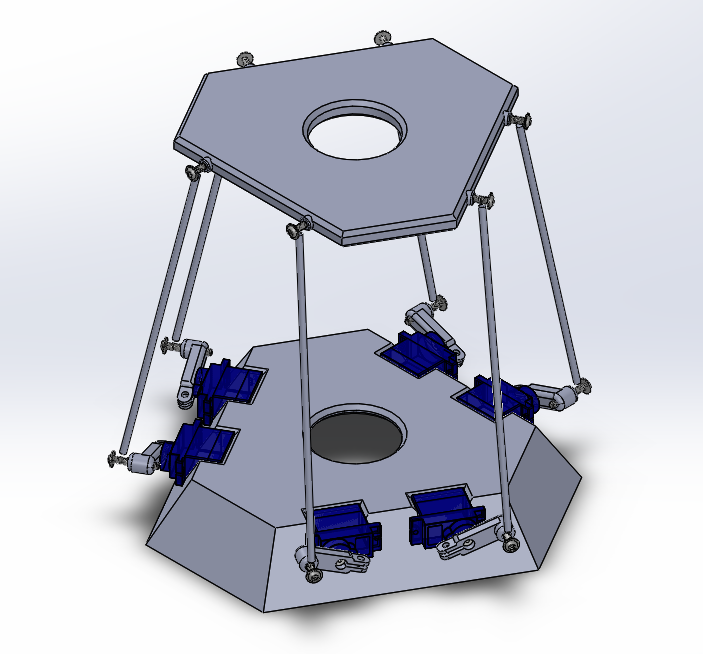

    <h1>SPUdeS</h1>
    <h3>Stewart Platform Université de Sherbrooke</h3>
    <h3>UdeS-GRO | 65th Promotion | 2021</h3>

[//]: # (------------------------------------------------)

    

 

[//]: # (------------------------------------------------)

**SPUdeS is a six degrees of freedom Stewart Platform. This is an academic project by robotics engineering undergraduates at l'Université de Sherbrooke.**

    

## Table of Contents
- [Setup](#Setup)
- [Documentation](#Documentation)
- [Robot Operation](#Operation)
- [External Resources](#Resources)
    - [Single-Board Computer](#Computer)
    - [Microcontroller](#Controller)
    - [Servomotors](#Servo)
    - [Power Supply: Motor/Arduino](#Power)

    
[//]: # (------------------------------------------------)

## Setup

## Documentation

## Platform Operation

## External Resources
This section specifies the external resources used in the project.

#### Single-Board Computer
- Brand: [Raspberry Pi](https://www.raspberrypi.org/products/raspberry-pi-3-model-b-plus/)
- Model: Raspberry Pi 3 Model 3B+
- Quantity: 1

#### Microcontroller
- Brand: [Arduino](https://store.arduino.cc/mega-2560-r3)
- Model: Mega 2560 REV3
- Quantity: 1

<!--#### Servomotors
- Brand: [Hitec RCD](https://hitecrcd.com/products/servos/sport-servos/analog-sport-servos/hs-422/product)
- Model: HS-422
- Quantity: 6
-->
#### Servomotors
- Brand: [Adafruit](https://www.amazon.ca/Adafruit-2201-Sub-micro-Servo-SG51R/dp/B0137LG0KW)
- Model: SG51R
- Quantity: 6

#### Power Supply: Motor/Arduino
- Brand: [CUI Inc.](https://www.digikey.com/en/products/detail/cui-inc/SWI10-5-N-P5/6618696)
- Model: SWI10-5-N
- Quantity: 1

## License
This project is licenced under a   license.
