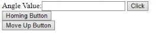

    <h1>SPUdeS</h1>
    <h3>Stewart Platform Université de Sherbrooke</h3>
    <h3>UdeS-GRO | 65th Promotion | 2021</h3>

[//]: # (------------------------------------------------)

    

 

[//]: # (------------------------------------------------)

**SPUdeS is a six degrees of freedom Stewart Platform. This is an academic project by robotics engineering undergraduates at l'Université de Sherbrooke.**

    

## Table of Contents
- [Setup](#Setup)
- [Documentation](#Documentation)
- [Robot Operation](#Operation)
- [External Resources](#Resources)
    - [Single-Board Computer](#Computer)
    - [Microcontroller](#Controller)
    - [Servomotors](#Servo)
    - [Power Supply: Motor/Arduino](#Power)

    
[//]: # (------------------------------------------------)

## Setup
1. Buy the component in the External Resources section
2. Build the Cad of the robot (3D printing) the dimensions look at the Documentation section about the Cad's dimensions.
3. Do the electrical connection see the electrical schematic in the documentation section.
3. Set up the raspberry and connect it with the arduino, your computer and the adaptor provided in the Raspberry kit.  
4. Download or clone the repository in the raspberry
5. Verify your Python version (3.5 and above) and the port series
6. Build and transfer all the code to the arduino and raspberry
7. Open the interface and look at the platform operation section
## Documentation
The Cad with is dimension and all is part can be found in the folder CAD's. 

Here is the electrical schematic to plug the motors with the good pins:

    

The dynamic system is in the section Modelisation Geometrique folder
## Platform Operation

The camera feed can show the robot instantly and if we zoom the section under the camera feed like this:

    

It is possible to enter the angle value of all the motor (all the motor should have the same angle) 
and once the command is entered in the white space click on the button click to send the command.

The Homing Button brings the stewart platform at its initial position who is centered.  

The Move Up Button brings the stewart platform a bit over its actual position
## External Resources
This section specifies the external resources used in the project.

#### Single-Board Computer
- Brand: [Raspberry Pi](https://www.raspberrypi.org/products/raspberry-pi-3-model-b-plus/)
- Model: Raspberry Pi 3 Model 3B+
- Quantity: 1

#### Microcontroller
- Brand: [Arduino](https://store.arduino.cc/mega-2560-r3)
- Model: Mega 2560 REV3
- Quantity: 1

<!--#### Servomotors
- Brand: [Hitec RCD](https://hitecrcd.com/products/servos/sport-servos/analog-sport-servos/hs-422/product)
- Model: HS-422
- Quantity: 6
-->
#### Servomotors
- Brand: [Adafruit](https://www.amazon.ca/Adafruit-2201-Sub-micro-Servo-SG51R/dp/B0137LG0KW)
- Model: SG51R
- Quantity: 6

#### Power Supply: Motor/Arduino
- Brand: [CUI Inc.](https://www.digikey.com/en/products/detail/cui-inc/SWI10-5-N-P5/6618696)
- Model: SWI10-5-N
- Quantity: 1

## License
This project is licenced under a   license.
The license chose is a license open source, so it is open for company and public user, but if an accident occurs when
users manipulate this project the owners of this project will not be responsible. Therefore, be sure to have a bit of 
experimentation before trying this project. 