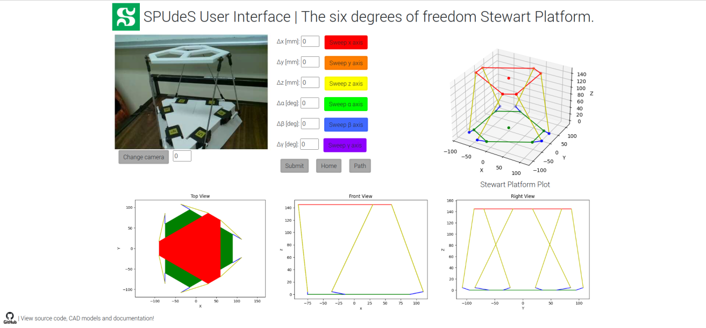
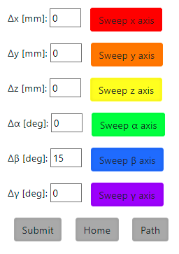
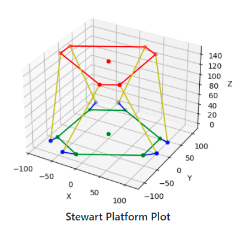

<div id="SPUdeS">
    <h1>
         <span>
            
         </span>
         SPUdeS
    </h1>
    <h3>Stewart Platform Université de Sherbrooke</h3>
    <h3>UdeS-GRO | 65<sup>th</sup> Promotion | 2021</h3>
</div>

[//]: # (------------------------------------------------)

<div id="badges">
    
[](https://www.travis-ci.com/github/SPUdeS/SPUdeS)
[](LICENSE) 

</div>

[//]: # (------------------------------------------------)

**SPUdeS is a six degrees of freedom Stewart Platform. 
This is an academic project by robotics engineering undergraduates at l'Université de Sherbrooke.**

<!-- TODO: Change image to be smaller and add a real image of platform -->
<div id="platform" align="center">
    
</div>

## Table of Contents
- **[Stewart Platforms](#Stewart)**
- **[Setup](#Setup)**
- **[Supplies](#Supplies)**
    - **[Single-Board Computer](#Computer)**
    - **[Microcontroller](#Controller)**
    - **[Servomotors](#Servo)**
    - **[Power Adaptor](#Power)**
    - **[Threaded Rods](#Rods)**
    - **[Heim Joints](#Joints)**
    - **[Hardware](#Hardware)**
    - **[Parts to solder](#Parts_solder)**
    - **[Parts to print](#Parts_print)**
- **[Platform Assembly Guide](#Assembly)**
    - **[Design](#Design)**
    - **[CAD Files](#CAD)**
    - **[Platform](#Platform)**
    - **[Base](#Base)**
    - **[Servo motor arms](#Servo)**
    - **[Legs](#Legs)**
    - **[Microcontroller holder](#Holder)**
    - **[Summary](#Summary)**
- **[Electrical Connection Guide](#Electrical)**  
  - **[Protoboard Soldering](#Proto)**
  - **[Soldering Recommendations](#Soldering)**
- **[Software Installation Guide](#Software)**
  - **[Machine requirements](#Machine_requirements)**
  - **[Cloning the Repository](#Cloning_the_Repository)**
  - **[Installing the requirements](#Installing_the_requirements)**
  - **[Running the server](#Running_the_server)**
- **[Arduino Setup Guide](#Motor_control)**
  - **[Arduino Communication Protocol](#Coms)**
  - **[PWM Precision](#PWM)**
- **[User Interface](#Operation)**
  - **[Camera](#Camera)**
  - **[Input](#Input)**
  - **[Graphical Representation of the Platform](#Graph)**
- **[License](#License)**  
 
[//]: # (------------------------------------------------)

## <a id="Stewart"></a>Stewart Platforms
A Stewart platform is a type of parallel robot built in such a way as to offer six degrees of freedom. 
This type of platform was created and publicised in the second half of the 20th century by three different engineers. 
Distributing the load on six legs allows for a strong manipulator while preserving high precision in movements. 
The combination of high strength and precision in six degrees of freedom makes this type of robot the ideal platform for various simulators (automobile, aviation). 
This type of robot as also been used for a telescope and tire testing machines.

Fundamentally, the platform is built from six linear actuators in parallel. 
Each ends of the linear actuators are linked to the fixed base and the manipulator via Heim joints. 
It is also possible to assemble the platform with rotary actuators. 
The rotation of an arm connecting to the base of the leg allows for some variation of the effective length of the legs emulating a linear actuator.
It is the way we have decided to build our prototype platform since servo motors are cheaper and easier to get our hands on then linear actuators.

## <a id="Setup"></a>Setup
1. Acquire the components in the **[Supplies](#Supplies)** section.
2. If needed, adapt the [CAD models](CADs) of the [base](CADs/Base.SLDPRT), the [platform](CADs/Platform.SLDPRT) and the [servo arms](CADs/Legs.SLDASM) to your specific dimensions.   
2.1. If you modified the [CAD models](CADs) regenerate the [3D printing files](CADs/V2%-%HS422/3D%printing%files).
3. 3D print the platform using the [3D printing files](CADs/V2%-%HS422/3D%printing%files). This may take several days.
4. Follow the **[Platform Assembly Guide](#Assembly)** to assemble the 3D printed parts. This requires the **[Supplies](#Supplies)**.
5. Follow the **[Electrical Connection Guide](#Electrical)** to solder the protoboard.
6. Follow the **[Software Installation Guide](#Software)** to set up the server and the user interface.
7. Follow the **[Arduino Setup Guide](#Motor_control)** guide to upload the [``StandardFirmata.ino``](SPUdeS/Arduino/StandardFirmata/StandardFirmata.ino) file to the Arduino.
8. Set up the *[Raspberry Pi](#Computer)* or a computer by connecting it with the *[Arduino](#Controller)*, your computer and to a power source.
9. Commands can be sent to the platform using the user interface. Refer to the **[User Interface](#Operation)** section for more information.

## <a id="Supplies"></a>Supplies
### <a id="Computer"></a>Single-Board Computer
- Brand: *[Raspberry Pi](https://www.raspberrypi.org/products/raspberry-pi-4-model-b/)*
- Model: Raspberry Pi 4 Model B
- Quantity: 1

### <a id="Controller"></a>Microcontroller
- Brand: *[Arduino](https://store.arduino.cc/mega-2560-r3)*
- Model: Mega 2560 REV3
- Quantity: 1

### <a id="Servo"></a>Servomotors
- Brand: *[Hitec RCD](https://hitecrcd.com/products/servos/sport-servos/analog-sport-servos/hs-422/product)*
- Model: HS-422
- Quantity: 6

### <a id="Power"></a>Power Adaptor (5V, 6A)
- Brand: *[CUI Inc.](https://www.digikey.com/en/products/detail/cui-inc/SWI10-5-N-P5/6618696)*
- Model: SWI10-5-N
- Quantity: 1

### <a id="Rods"></a> Threaded Rods
- Brand: *[uxcellM3](https://www.amazon.ca/gp/product/B01M9D4ASU/ref=ppx_yo_dt_b_asin_title_o08_s00?ie=UTF8&psc=1)*
- Model: a16071500ux0035
- Quantity: 6

### <a id="Joints"></a> Heim Joints
- Brand: *[Que-T](https://www.amazon.ca/gp/product/B08217LDWH/ref=ppx_yo_dt_b_asin_title_o07_s00?ie=UTF8&psc=1)*
- ASIN: B08217LDWH
- Quantity: 12

### <a id="Hardware"></a> Hardware
-	Threaded inserts M3 x 6mm (42x; optional)
-	Countersunk bolts M3x6 (6x; optional)
-	Countersunk bolts M3x12 (42x)
-	Nylock nuts M3 (6x)
-	Round head self-tapping screws No3 (6x)

### <a id="Parts_solder"></a> Electrical Parts
- Proto-board (1x)
- Pin / Female headers (6x)
- Wires 
- Soldering iron and solder
     
### <a id="Parts_print"></a> Parts to print
There are four parts to print: the [platform](CADs/V2%20-%20HS422/Platform.SLDPRT), 
the [base](CADs/V2%20-%20HS422/Base%20V3.SLDPRT), 
the [microcontroller holder](CADs/V2%20-%20HS422/MicroController%20Holder.SLDPRT) 
and the [servo arms](CADs/V2%20-%20HS422/ServoArm.SLDPRT). 
Materials needed:
- A spool of PLA
- Access to a 3D printer


## <a id="Assembly"></a>Platform Assembly Guide
### <a id="Design"></a>Design
The main components of the robot are the base, the arms fixing the legs to the servo motors, the legs themselves, and the platform. 
The geometry and proportions of the platform are critical factors allowing the position of the manipulator to be completely defined. 
Furthermore, using rotary actuators elevate the complexity versus using simple actuators. 
Thankfully, Robert Eisele has proposed and published a solution for the inverse kinematics of the platform using rotary actuators. 
Building from his *[work](https://www.xarg.org/paper/inverse-kinematics-of-a-stewart-platform/)*, it is possible to develop a custom sized platform given we respect some parameters. 
For those of you who would want to change the values we used be sure to look at the parameters defined in the configuration files of the project. 
We would strongly advise also trying your new parameters in the CAD files to inspect proportions and overall look. 
We have drawn them based on variables to make it easy for the user to input whatever values desired for the basic parameters.

To keep the project as simple as possible, we have designed the platform to be table-top sized. 
This way, it is not too small so that the hardware is easily available at the hardware store. 
On the other hand, it is not too big, so the cost of material isn’t prohibitive either. 
For maximum flexibility we based all our design on the fact that a 3D printer was readily available. 
One could use other ways to build the platform out of different materials, but we felt 3D printing was the more practical means of fabrication for most.

### <a id="CAD"></a>CAD Files
First of all, you’ll find two version of the platform. The version one being a prototype with smaller servo motors. 
We’ve moved on from that design to upgrade to [better motors (HS-422 model)](CADs/V2%20-%20HS422). 
Those motors are more powerful limiting the impact of friction in the Heim joints at both ends of the legs. 
Note that the [CAD files of the first version](CADs/V1%20-%20SG90%20-%20Deprecated) aren’t based on variables lengths and dimensions aren’t defined the same way as the second version. 
This is important since the values in the configuration file of the main program are based on the second version’s way of dimensioning the platform. 
A reader that would want to build the first platform would have to manually measure (in the CAD software) some of the variables to update the [``configuration files``](SPUdeS/Platform/config.py) variables. 
As stated earlier, the brass inserts are optional. But if not using them, don’t forget to adjust the size of the holes where bolts will be threaded. 
Using M3 bolts, we’d recommend holes about a quarter to half a millimeter less in diameter to allow the thread to grip well on the plastic. 
The exact size depends on the precision of the printer used and orientation of the print; this I just a recommendation and testing should be done before hand.

### <a id="Platform"></a>Platform
The word platform in its general sense describes the project in whole (Stewart Platform). 
But we also use the term to refer specifically to the upper part of the robot. 
It is a way to distinguish it from the base and the legs. 
[The platform](CADs/V2%20-%20HS422/Platform.SLDPRT) is one of the simplest parts of the project. 
It is also one that allows for lots of customization. 
This piece could be redesign to whichever shape is desired while keeping in mind that the more weight is added at the top, the greater the load placed on the servos is. 
The only other thing to keep in mind would be to try keep the anchors in the general vicinity of the anchors of the base. 
That way, in the home position, the legs are as upright as possible and allow for better movement. 
The usage of rotary actuators to lift the legs up creates a plane in which the servo arms operate. 
Since the [Heim joints](CADs/V2%20-%20HS422/Rod%20End) have an angular limit on the movement they allow, starting with upright legs effectively put the interior portion of the join at 90 degrees to the leg itself and allows for the greatest range of motion.

Printing the model provided needs no support and will take about 4 hours. 
This time is only provided as an indication since lots of parameters can impact the printing time (we used a standard layer height of 0.20 mm, 3 horizontal walls, 4 vertical walls and a 15% gyroid infill). 
For the assembly it is really simple, only install the threaded inserts press-fit in the six anchor holes. 
This is where the upper part of each leg will attach. Note that inserts are optional as stated earlier, but don’t forget to resize the anchor holes properly. 

### <a id="Base"></a>Base
[The base](CADs/V2%20-%20HS422/Base%20V3.SLDPRT) is the longest part to print and the more complex part of the build. 
Most of the assembly starts here and the operation of the platform is heavily linked to the geometry of this part. 
That is to says, if the platform is a part which allows for creativity, the base isn’t so much. 
For someone who would like to play with the fundamental geometry of the base we’d strongly advice to look attentively at the paper provided in reference (solution for the inverse kinematics of a servo motor operated Stewart platform by Robert Eisele). 
For others that would only like to resize the project, this is facilitated by the variables included in the CAD files. 
Note that the measurements of the motors are also variables, so it is also possible to change the motors for bigger or smaller projects without having to redraw the base. 
Just don’t forget to adjust the value of the parameters contained in the configuration file so the computation is accurate for your new dimensions. 
The printer used for our version was the Pruas Mini+ which has a build volume of 18 cm x 18 cm x 18 cm, for this reason the base is [split in three parts](CADs/V2%20-%20HS422/Base%20V3-Split.SLDPRT). 
The undivided part is also available for people using printers with bigger build volumes or is downsizing the platform results in not enough space to bolt the different pieces together. 
We suggest printing the parts up-side down. 
Leveraging the draft angle of the design and the overhang capabilities of the printer to our advantage to reduce support to its minimum saves more then an hour per piece (a third of the base). 
If your bridging parameters are well dialed-in, the part can be printed as is in the upside-down orientation. 
Otherwise, the part needs some supports that you can apply to the faces where the servo motors lie. 
Since there’s minimal support needed, the print time added is negligeable and we’d suggest taking this route since in the end the surface will look better, and it is probably not worth risking disappointing surface finish only to save couple of minutes on a ten plus hours print. 
With three walls and the rest of the parameters the same, it takes about 30-32 hours in total to complete printing the base. Don’t forget to resize holes if not using the inserts.

To assemble the platform, follow those steps:
1.	Fix the three parts of the base together with the M3x16 mm bolts (6) and the nylon locknuts (6). Holes for the bolts and to fix the nut in place are located underneath the base. \
&nbsp;&nbsp;&nbsp;&nbsp;&nbsp;&nbsp; a.	Be sure to tighten enough so that the parts do not have room to move relative to each other.\
&nbsp;&nbsp;&nbsp;&nbsp;&nbsp;&nbsp; b.	The nut may start to turn within the hexagonal hole where it’s located because of the friction of the nylon transferring the torque of the bolt. Wedging a small flat head screwdriver or a small Exacto blade helps retain the nut in place while tightening the bolt.
2.	Install the inserts that allow for the servos to be fixed. Note that four inserts are more then required for the application but since we had them, and the servo used had four holes to fix them we used them all. This is not optimal in any way nor is it required.
3.	Pass the wires of the servo motors through the holes in the base and slide the motors in place.
4.	Install the bolts to fix the servos.

### <a id="Servo"></a>Servo motor arms
The [servo arms](CADs/V2%20-%20HS422/ServoArm.SLDPRT) are the parts that requires the less time for the print and are simple to assemble. 
The bridging parameters will impact the looks of one side of the arm, printing toothed side-down will allow the better-looking side to be facing out at installation (surface irregularities due to the bridging end up on the base-facing side of the arm). 
Printing the 6 servo arms at once will only take about one hour. 
We advise using the same general parameters but increasing the number of walls (increasing the infill percentage doesn’t have as much impact). 
That way, the arms are sturdier and print time isn’t that much longer. 
Once printed, install the threaded insert in the round hole, then install the toothed side onto the servo motor shaft. Do not push hard on the shaft towards the servo motor, it could damage the motors. 
Instead, put the arm in place and gently screw it in place. The self-tapping screw will thread into the plastic shaft pulling the arm on its way. 
When placing the arms, be sure that the range allowed by the servos (about 180 degrees) span the bottom to the top of the base and faces the exterior. 
This allows the leg to have a full range of motion from the lower point to the highest point of the arc made by the rotation of the arm. 
In the configuration used we like the arms to be outside facing but inside would be another working configuration (all arms must be the same in one or the other configuration).

### <a id="Legs"></a>Legs
The legs are simply the [female Heim joints](CADs/V2%20-%20HS422/Rod%20End) threaded at both ends of the [150 mm rods](CADs/V2%20-%20HS422/Tige%20filetée.SLDPRT). 
Be sure to them facing approximately in the same direction so that the range of motion isn’t hampered. 
Then it is just a question of fixing the legs to both the base and the platform using the M3 blots. 
The major triangle in the base and the platform should be inverted as shown in the image. 

### <a id="Holder"></a>Microncontroller holder
The positioning of the microcontrollers is up to you. 
The [holder](CADs/V2%20-%20HS422/MicroController%20Holder.SLDPRT) piece doesn’t have holes in it. 
Depending on the type of different microcontroller used to drive the platform, bolt patterns may vary. 
For this reason, we suggest marking drilling holes at the location you want to place the microcontrollers on the holder. 
Then it is only a question of installing the inserts (drill a hole smaller than the insert diameter to allow for a press-fit in the plastic) and using small M3x6 mm bolts to fix the microcontrollers. 
The holder should snap in place beneath the base. 

### <a id="Summary"></a>Summary
Printing all the pieces required for the build takes about 560 grams of PLA which is a bit more than half a spool. 
Accounting for three quarters to an entire spool’s (1 kg) worth of PLA is advisable for someone who’d want to do tests to optimize surface finish. 
The pictures shown below illustrate how the principal components are fastened to the platform (in this case, the base is in one piece but the three-pieces model is assembled in the same way).

<div id="platform" align="center">
    
</div>

Now it is only a question of uploading the codes to the Arduino and the raspberry pi and connecting both with the appropriate power adaptors. 
Launching the web server allows for a clean interface where the user can command the platform.

## <a id="Electrical"></a>Electrical Connection Guide
### <a id="Proto"></a>Protoboard Soldering
This section makes reference to the [electrical schematics](Documentation/Electical%20schematics.pdf).The electrical part of the assembly requires you to solder a protoboard. 
-	Solder two female pin headers to the protoboard. This will be used for the power supply by connecting two male connectors; one for the ground and one for the VCC.
-	Solder 6 short wires to the protoboard’s positive (VCC) side. These will be used on the positive side of each motor.
-	Solder 7 short wires to the protoboard’s ground side. These will ground each motor and the Arduino.
-	Each of the motors will need an additional wire to plug into the digital pin of the Arduino. 

<div style="text-align: center;">
  <table style="margin: 0px auto">
    <tr>
      <td> Motor 1 </td>
      <td> Motor 2 </td>
      <td> Motor 3 </td>
      <td> Motor 4 </td>
      <td> Motor 5 </td>
      <td> Motor 6 </td>
    </tr>
    <tr>
      <td> Pin 7 </td>
      <td> Pin 9 </td>
      <td> Pin 11 </td>
      <td> Pin 12</td>
      <td> Pin 5 </td>
      <td> Pin 3 </td>
    </tr>
  </table>
</div>

### <a id="Soldering"></a>Soldering Recommendations	
The motor positioning is important so be careful when plugging them. Here are some tips you can use:
-	Soldering will be simpler if you minimise the distance between the components.
-	Be careful to not touch the protoboard.
-	It can be useful to use more solder than usual.

## <a id="Software"></a>Software Installation Guide
The interface was build using the Python micro framework Flask. We built our webpage using html and handle our requests by using Javascript functions and route handling on the server side.
### <a id="Machine_requirements"></a> Machine Requirements
Our project runs on specific versions of Python:
- [``Python 3.7``](https://www.python.org/downloads/release/python-3710/)
- [``Python 3.8``](https://www.python.org/downloads/release/python-389/)
- [``Python 3.9``](https://www.python.org/downloads/release/python-394/)

[``pip3``](https://pip.pypa.io/en/stable/) is also required to install the project's various packages.
### <a id="Cloning_the_Repository"></a>Cloning the Repository
Let us start the installation by cloning the repository. 
You may choose to do this via the Github Desktop App or through some code versioning software such as Sourcetree or Square Desktop. We will use Git in a terminal. 
If you haven't already, download [``Git``](https://git-scm.com/downloads).
Start by entering into the folder you want the project to be in and open up a terminal. Next use the following command to clone the repository.
```shell
git clone https://github.com/SPUdeS/SPUdeS.git
```
### <a id="Installing_the_requirements"></a>Installing the requirements
Now you will need to install the modules and packages needed to run the server. Go ahead and run this next command.
```shell
pip3 install -r requirements.txt
```
The [``requirements.txt``](requirements.txt) file is what lets you download all the dependencies for the project.
If you get an error where an import is missing, please install it manually. For example, to download OpenCV manually you will open back up that terminal window and write the following.
```shell
pip3 install opencv-python
```
If you are using a Raspberry Pi and are still having issues with OpenCV, *[this link](https://stackoverflow.com/questions/53347759/importerror-libcblas-so-3-cannot-open-shared-object-file-no-such-file-or-dire)* may be helpful.
### <a id="Running_the_server"></a>Running the server
Starting from the root of the repository, run the server with this command.
```shell
python3 SPUdeS.py
```
To see the interface webpage visit *[this address](http://127.0.0.1:5000)* on the same machine: ``http://127.0.0.1:5000`` 

## <a id="Motor_control"></a>Arduino Setup Guide

### <a id="Coms"></a>Arduino Communication Protocol
To control the servo motors, we use a microcontroller, the *[Arduino Mega 2560](#Controller)*. 
Since the angles we need to send to the servos are calculated in our inverse kinematics python code, we chose to communicate directly from a python program to the Arduino. 
This is done using the open source *[pyFirmata library](https://github.com/tino/pyFirmata)*, which applies the *[Firmata protocol](https://github.com/firmata/protocol)* for communication with microcontrollers. 
To use this protocol, we simply need to send the [``StandardFirmata.ino``](SPUdeS/Arduino/StandardFirmata/StandardFirmata.ino) file to the Arduino and import the pyFirmata library into our program.

We created a class, [``ard_communication``](SPUdeS/Arduino/ard_communication.py) that applies this concept. 
There are two ways to use it, the first being to simply run it and use its functions in the main, a way that was mostly used to test the motor movements with preprogrammed trajectories and manual inputs. 
The second way is to initialize an instance of the class in our server, and then use its functions there, as we did with our end to end project. 
Its main function is setServoAngle, which receives an array of n arrays of 6 angles, one for each motor. 
It can take angles in degrees and radians, depending on the parameter isRad, which will make sure to correct the angles so they are sent in degrees to the Arduino.

For now, the class uses the digital pins of the Arduino in their pyFirmata.SERVO mode, which makes it so we can send angles in degrees to the Arduino, and it will convert it to a corresponding voltage in PWM to the servos. 
This has some drawbacks, such as a loss in precision of the angles since the digital.write function requires integer values. 
Also, the discretization of the trajectory can look somewhat choppy because the program needs to sleep for a certain amount of time before sending a new angle, otherwise it will miss some waypoints.

### <a id="PWM"></a>PWM Precision
This brings us to the next step for the motor control aspect of the project. 
There is a possibility to change the digital pins' mode to pyFirmata.PWM and change the file uploaded to the Arduino with a modified version of 
example file *[simpleAnalogFirmata](https://github.com/grappendorf/arduino-framework/blob/master/Firmata/examples/SimpleAnalogFirmata/SimpleAnalogFirmata.ino)*. 
[Our implementation of this file](/SPUdeS/Arduino/PWMFirmataBeta/PWMFirmataBeta.ino) was still in beta and not ready for use with our [ard_communcation](SPUdeS/Arduino/ard_communication.py) module. 
The goal of these changes is to change from an 8 bit resolution PWM to a 16 bit resolution PWM and get rid of the integer restriction of the digital.write function. 
With a few changes, this could allow much more precision in the platform's movements, but might reduce the refresh rate of the PWM, which could cause other issues. 
It is still the next step for motor control since precision is crucial for a Stewart's platform. 
Though it was not needed yet for our implementation of the platform since it currently has no real function and the standard Firmata file with the SERVO mode for the Arduino's pins are enough for our proof of concept.


## <a id="Operation"></a>User Interface
The user interface (UI) is implemented using [this html file](SPUdeS/PythonUI/templates/index.html). 
We used *[Bootstrap](https://getbootstrap.com)* to format the webpage and Javascript to handle requests.
The user interface can be split into three main parts:
- The Camera
- The User Input
- The Graphical Representations of the Platform

<div align="center">
    
</div>

### <a id="Camera"></a>Camera
The camera was implemented to show the platforms movements live through the UI. 
We used *[OpenCV](https://opencv.org)* to implement the live video feed.
We have tested the use of a laptop webcam and a Raspberry Pi camera. Both have worked 
successfully. There is a button and input that allow you to change the port of the 
camera being used. 

<div align="center">
  
</div>

### <a id="Input"></a>User Input
Firstly we have inputs for specific positions of different axes possible. 
To use these enter a value in as many of the boxes and hit the button Submit. 
This sends the request to the server to sent to the platform and the update of the graphs. 
Secondly we have the sweep buttons for each axis. These are preprogrammed paths to show the range of motion on that specific axis. 
Clicking the corresponding axis button submits the request. 
Thirdly there is a button for homing the platform at a predetermined angle specified in[ard_communication](SPUdeS/Arduino/ard_communication.py). Lastly there is a button called Path that performs a combination of all the sweep movements.

<div align="center">
    
</div>

The push of a button calls a Javascript function that creates a new XML HTTP Request. 
Some Javascript functions create a json payload of the type of displacement called and the position that is sent. 
The function then POSTs and calls the route used in the Flask server. 
From the server side we are able to handle the request by using payload in a cinematic function. 
We then send a response to motors and an update of the graph.


### <a id="Graph"></a>Graphical Representation of the Platform
The graphical representation is updated using the [``stewartPlatform.py``](SPUdeS/Platform/stewartPlatform.py) which uses *[matplotlib](https://matplotlib.org)* to represent the platform graphically. 
The same input used to send the movement command to the motors is used to created an updated graph. 
However the graph does not update automatically on the interface. The user needs to use F5 or CTRL+F5 to update the graphs on the UI.

<div align="center">
  
</div>

There are other views of the platform included at the bottom of the interface for a better visual of the movement sequence.

## <a id="License"></a>License
This project is licenced under a  [](LICENSE) license.
This license ensures the community can use, modify and share our project.
